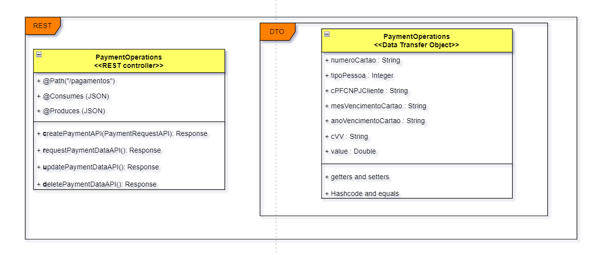
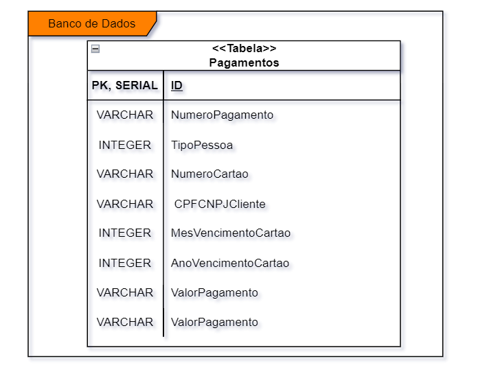

# **Descrição do Desafio (Enslish version below)**
## Desafio de Programação em Java Quarkus - Microsserviço de Recebimento e Armazenamento de Pagamento com Cartão de Crédito

**Descrição:** Você foi designado para desenvolver um microsserviço em Java Quarkus que recebe dados de um pagamento fictício realizado com cartão de crédito e armazena essas informações. O microsserviço deve validar se os dados recebidos estão no formato correto e, em seguida, persistir essas informações em um banco de dados relacional. Além disso, o microsserviço deve fornecer um endpoint HTTP para receber os dados do pagamento e um mecanismo para consulta posterior desses dados armazenados.

**Requisitos Técnicos:**

Utilize o framework Quarkus para criar o microsserviço Java.

- Crie uma função que receba os dados do pagamento (em formato JSON) e valide se eles estão no formato esperado antes de prosseguir.
- Utilize um banco de dados relacional (por exemplo, PostgreSQL ou MySQL) para armazenar os dados do pagamento. Crie uma tabela adequada para armazenar essas informações.
- Implemente um endpoint HTTP (por exemplo, utilizando JAX-RS) que permita o envio dos dados do pagamento para o microsserviço.
- Forneça uma funcionalidade adicional para consultar os dados de pagamento armazenados no banco de dados.

**Instruções:**

- O candidato deve criar um repositório Git para o projeto e fornecer o link quando concluir. (sugestão: GitHub)
- Certifique-se de que os dados de pagamento sejam armazenados corretamente no banco de dados após a validação.

**Opcional:**

- O candidato poderá entregar configurações para rodar o microsserviço em container (Dockerfile, docker-compose...)
- O candidato poderá disponibilizar no código a geração de uma métrica Prometheus através de um endpoint com a assinatura `/metrics`. Pode ser qualquer tipo de métrica (contador, histogram, summary ou gauge) para ser aplicado nos próprios endpoints implementados.

**Avaliação:**

- Será avaliado a qualidade do código, a organização, eficiência da solução e boas práticas de programação.
- Certifique-se de verificar se o microsserviço valida os dados de pagamento, os armazena corretamente no banco de dados e fornece uma maneira de consultar esses dados posteriormente.

## Java Quarkus Programming Challenge - Microservice for Receiving and Storing Credit Card Payments
**Description:** You have been assigned to develop a Java Quarkus microservice that receives data from a fictitious credit card payment and stores this information. The microservice should validate if the received data is in the correct format and then persist this information in a relational database. In addition, the microservice should provide an HTTP endpoint to receive the payment data and a mechanism for subsequent query of this stored data.

**Technical Requirements:**

- Use the Quarkus framework to create the Java microservice.
- Create a function that receives the payment data (in JSON format) and validates if they are in the expected format before proceeding.
- Use a relational database (for example, PostgreSQL or MySQL) to store the payment data. Create a suitable table to store this information.
- Implement an HTTP endpoint (for example, using JAX-RS) that allows sending the payment data to the microservice.
- Provide an additional functionality to query the payment data stored in the database.

**Instructions:**

- The candidate must create a Git repository for the project and provide the link when finished. (suggestion: GitHub)
- Make sure that the payment data is correctly stored in the database after validation.

**Optional:**

- The candidate may deliver settings to run the microservice in a container (Dockerfile, docker-compose…)
- The candidate may make available in the code the generation of a Prometheus metric through an endpoint with the /metrics signature. It can be any type of metric (counter, histogram, summary or gauge) to be applied to the implemented endpoints themselves.

**Evaluation:**

- The quality of the code, organization, efficiency of the solution, and good programming practices will be evaluated.
- Make sure to check if the microservice validates the payment data, correctly stores them in the database, and provides a way to query these data later.

# Solution by Lucas Batista: card-payment-api

## Modelo UML da camada REST

***

## Modelo UML da camada MODEL

***

## Modelo UML do banco de dados


end of authorial documentation.
***

The documentation below has been generated by Quarkus.

This project uses Quarkus, the Supersonic Subatomic Java Framework.

If you want to learn more about Quarkus, please visit its website: https://quarkus.io/ .

## Running the application in dev mode

You can run your application in dev mode that enables live coding using:
```shell script
./mvnw compile quarkus:dev
```

> **_NOTE:_**  Quarkus now ships with a Dev UI, which is available in dev mode only at http://localhost:8080/q/dev/.

## Packaging and running the application

The application can be packaged using:
```shell script
./mvnw package
```
It produces the `quarkus-run.jar` file in the `target/quarkus-app/` directory.
Be aware that it’s not an _über-jar_ as the dependencies are copied into the `target/quarkus-app/lib/` directory.

The application is now runnable using `java -jar target/quarkus-app/quarkus-run.jar`.

If you want to build an _über-jar_, execute the following command:
```shell script
./mvnw package -Dquarkus.package.type=uber-jar
```

The application, packaged as an _über-jar_, is now runnable using `java -jar target/*-runner.jar`.

## Creating a native executable

You can create a native executable using: 
```shell script
./mvnw package -Dnative
```

Or, if you don't have GraalVM installed, you can run the native executable build in a container using: 
```shell script
./mvnw package -Dnative -Dquarkus.native.container-build=true
```

You can then execute your native executable with: `./target/api-pagamento-cartao-1.0-runner`

If you want to learn more about building native executables, please consult https://quarkus.io/guides/maven-tooling.

## Related Guides

- RESTEasy Classic ([guide](https://quarkus.io/guides/resteasy)): REST endpoint framework implementing Jakarta REST and more

## Provided Code

### RESTEasy JAX-RS

Easily start your RESTful Web Services

[Related guide section...](https://quarkus.io/guides/getting-started#the-jax-rs-resources)
